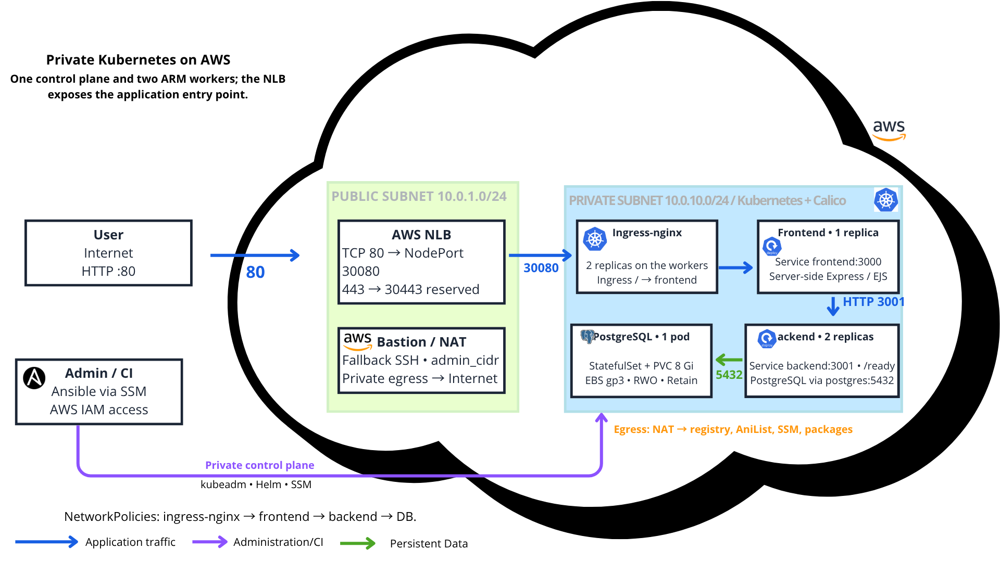

# Anime Review · application delivery to Kubernetes

A personal anime and manga library featuring AniList search, reader profiles, media lists, ratings and reviews. The project also provides a DevOps learning path, from Docker Compose to Kubernetes on AWS.



## Documentation

- [Current Kubernetes delivery](#kubernetes-delivery)
- [Variables and secrets](docs/CONFIGURATION.md)
- [Local development and Compose](legacy/local/README.md)
- [Historical VM delivery](legacy/vm/README.md)
- [Recovered CI versions](docs/ci-history/README.md)

The proposed `legacy/` directories hold documentation for earlier deployment phases. They do not duplicate or relocate application code. Docker Compose remains available at the repository root for development; commands in the legacy guides run from that root.

The other repositories are [anime-review-infra](https://github.com/Songhai9/anime-review-infra) (AWS, Terraform, Ansible) and [anime-review-k8s](https://github.com/Songhai9/anime-review-k8s) (add-ons and workloads). Pipelines use their GitLab projects: `songhai9/manga-app`, `anilist-cicd/anilist-infra`, and `anilist-cicd/anilist-k8s`.

## Implemented DevOps features

- Separate Express/EJS frontend, Express JSON API and PostgreSQL 16 database. API calls originate from the frontend server; SQL credentials remain on the API side.
- Multi-stage Dockerfile: dependencies, tests, API runtime and frontend runtime. Node.js 24 slim, lockfile-based dependency installation, production dependencies and a non-root user in the final images.
- Compose: service networking, `api`/`db` DNS resolution, health-dependent startup, persistent PostgreSQL volume and SQL initialization scripts.
- ESLint, unit tests, PostgreSQL integration tests and coverage thresholds of 80% lines, 60% branches and 75% functions. These are thresholds, not measurements from the latest pipeline.
- `/health` checks the process; the API's `/ready` actually queries PostgreSQL. The frontend exposes `/health`.
- GitLab CI on `main`: quality → tests → two Buildx builds for `linux/amd64,linux/arm64` → GitLab registry → Kubernetes repository pipeline.
- Image tags based on the short commit SHA. Both images come from the same commit, without building on the deployment hosts.
- A supplementary GitHub Actions workflow. It does not replace the GitLab chain: its single final-image build does not provide the same two-image delivery contract.

## Code map

| Path | Responsibility |
|---|---|
| `frontend/`, `views/`, `public/` | Web server, EJS rendering and styles |
| `api/` | JSON routes, validation, SQL and AniList access |
| `api/database/initialize.js` | Schema execution at startup, optional seed |
| `sql/schema.sql`, `sql/seed.sql` | Schema and demonstration data |
| `test/unit/`, `test/integration/` | Isolated checks and real-database tests |
| `Dockerfile`, `docker-compose.yaml`, `compose.test.yml` | Images and container environments |
| `.gitlab-ci.yml`, `.github/workflows/ci.yml` | GitLab and GitHub automation |

## Known limitations

Reader profiles are not an authentication system. The code applies a rate limiter, which does not replace authentication or comprehensive abuse protection. AniList integration depends on an external service and its quotas.

The schema runs whenever the API starts and also drops some legacy objects. This does not replace versioned migrations. Back up data before changing the schema. `DATABASE_SSL=true` currently disables server certificate verification in the SQL client; it must not be described as full TLS certificate validation.

## Reference

Based on commit `e71a2ad909b0c90219780278611973a395ba2eb4`, rechecked on September 29, 2026. Deployment commands are derived from the code; they were not executed against AWS while preparing this README.

[Detailed sources and documented revision](docs/SOURCES.md).

## Kubernetes delivery

### Image contract

| Image | Listening port | Configuration | Availability |
|---|---|---|---|
| `backend:SHA` | 3001 | PostgreSQL through environment variables; password from a Secret | `/health` and `/ready` |
| `frontend:SHA` | 3000 | `API_URL=http://backend:3001` | `/health` |

Images contain the application code, required dependencies and, for the API, SQL files. Do not copy a local `.env` into the images. Kubernetes manifests inject runtime values; `DATABASE_PASSWORD` comes from `postgres-secrets/POSTGRES_PASSWORD`.

### Setup order

1. Provision networking and instances with `anime-review-infra/terraform`.
2. Run Ansible to obtain a working kubeadm cluster with Calico and Helm.
3. Publish both images and verify ARM64 support and worker access to the registry.
4. Initialize add-ons, the Secret, storage and workloads through `anime-review-k8s`. This first installation is separate from application CI.
5. Configure the multi-project trigger and OIDC in GitLab, then run an application delivery.

Detailed AWS and Kubernetes procedures are in the other two repository packages. Application CI alone cannot build an empty cluster.

### What the current pipeline does

After tests pass, Buildx publishes both architectures of both images. `trigger_k8s` starts `anilist-cicd/anilist-k8s` on `main` with:

```text
IMAGE_TAG       = CI_COMMIT_SHORT_SHA
BACKEND_IMAGE   = CI_REGISTRY_IMAGE/backend:CI_COMMIT_SHORT_SHA
FRONTEND_IMAGE  = CI_REGISTRY_IMAGE/frontend:CI_COMMIT_SHORT_SHA
```

The pipeline derives these variables; do not manually supply three inconsistent values. Update `trigger.project` if the GitLab project is renamed. The target project must allow the source project, and the triggering user must be allowed to run its pipeline.

The K8s repository changes both image references, commits them and deploys that exact commit through AWS SSM. Jobs wait for the backend and then the frontend to become ready. With `strategy: depend`, the application pipeline tracks the downstream result.

### Verify a delivery

- Record the application SHA and both published tags.
- Check the generated manifests commit in the K8s repository and `DEPLOY_SHA`.
- Check SSM command status, then Kubernetes rollouts and events.
- Compare pod images against the expected references and test the functional workflow through the NLB.

Two backend replicas do not provide full high availability: the frontend, PostgreSQL and control plane are single instances. This repository does not configure HPA, SQL migration Jobs or automatic rollback. The GitHub Actions workflow does not trigger this GitLab delivery chain.
