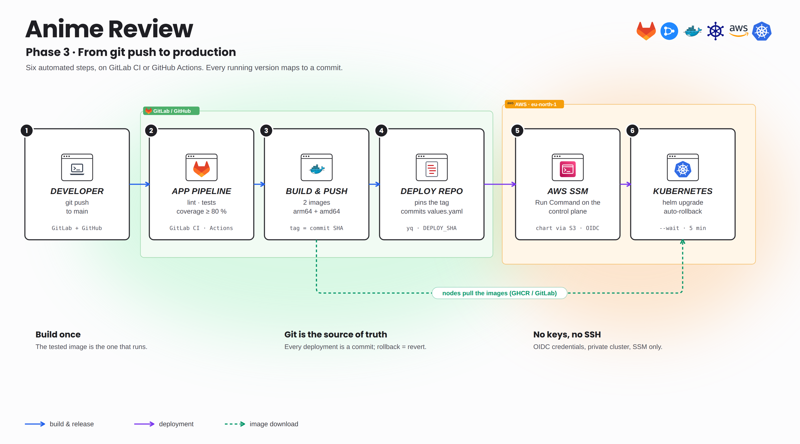
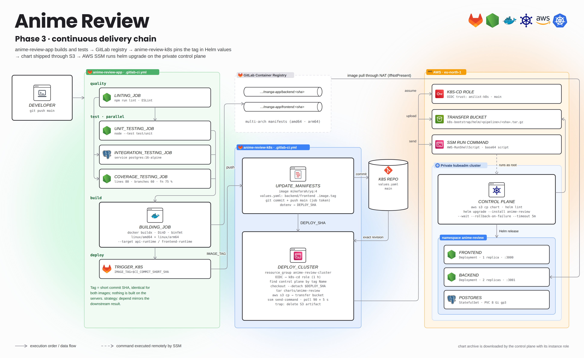
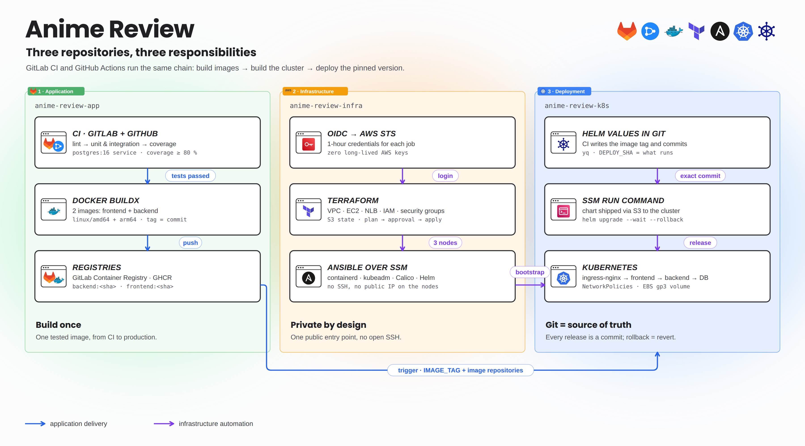
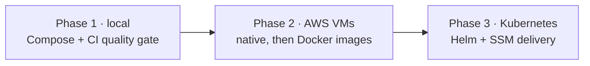
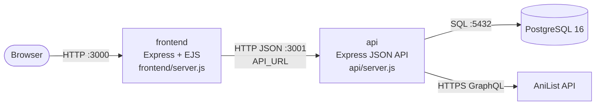
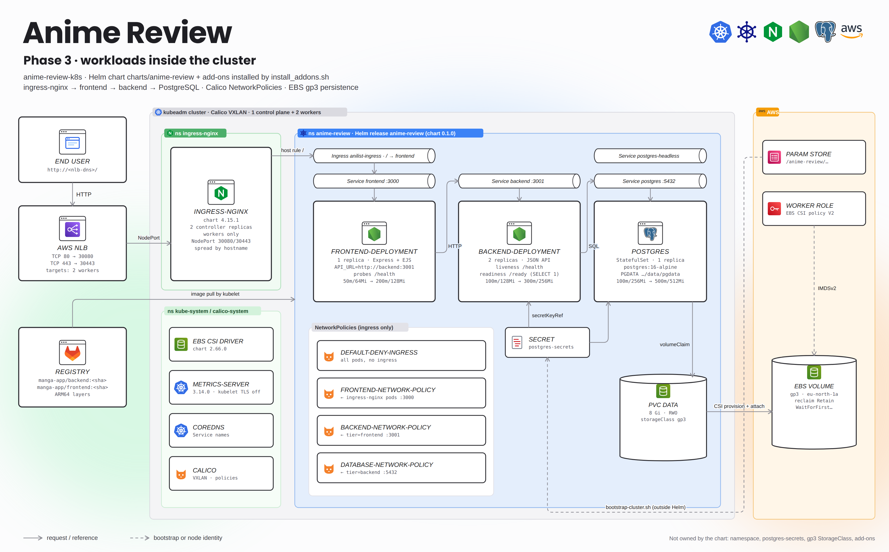

# Anime Review · Application

A personal anime and manga library: search titles through the AniList API, create reader profiles, build lists, rate and review. The application is the payload of a **DevOps learning path** that goes from Docker Compose on a laptop to a private Kubernetes cluster on AWS. This README describes the application and its **current delivery (phase 3, Kubernetes)**; earlier phases are under [`legacy/`](#project-phases).



<details>
<summary><b>Detailed view</b> (every component, port and job)</summary>



</details>

| Repository | Role |
|---|---|
| **anime-review-app** (this repo) | Code, tests, Dockerfile, images, app pipeline |
| [anime-review-infra](https://github.com/Songhai9/anime-review-infra) | AWS network, VMs / kubeadm cluster (Terraform + Ansible) |
| [anime-review-k8s](https://github.com/Songhai9/anime-review-k8s) | Add-ons, Helm chart, deployment through AWS SSM |



GitLab projects used by the pipelines: `songhai9/manga-app` (this repo), `anilist-cicd/anilist-infra`, `anilist-cicd/anilist-k8s`.

## Project phases



| Phase | App side | Infra side |
|---|---|---|
| 1 · Local | [legacy/local](legacy/local/README.md): Compose, tests, first pipeline | — |
| 2 · AWS VMs | [legacy/vm](legacy/vm/README.md): multi-arch images, trigger infra | [infra › legacy/local](https://github.com/Songhai9/anime-review-infra/tree/main/legacy/local) (native) · [infra › legacy/vm](https://github.com/Songhai9/anime-review-infra/tree/main/legacy/vm) (Docker) |
| 3 · Kubernetes | this README | [infra README](https://github.com/Songhai9/anime-review-infra) · [k8s README](https://github.com/Songhai9/anime-review-k8s) |

## Application architecture



- **Three tiers, two images.** The frontend renders pages server-side and calls the API from the server; the browser never talks to the API. Only the API holds database credentials.
- **Health endpoints.** `/health` on both services (process up); `/ready` on the API runs a real query against PostgreSQL. Compose, Ansible and Kubernetes probes all use them.
- **Schema management.** `api/database/initialize.js` applies `sql/schema.sql` at startup; `DATABASE_SEED=true` loads demo data.

## Implemented DevOps features

| Area | Implementation |
|---|---|
| Containerization | Multi-stage `Dockerfile` on `node:24-slim`: `dependencies` → `test` (lint + unit), and two independent runtime targets `api-runtime` / `frontend-runtime` with production dependencies only, running as `USER node` |
| Local environment | `docker-compose.yaml`: service DNS (`api`, `db`), healthchecks and `depends_on: service_healthy`, named volume, SQL init scripts; `compose.test.yml`: throw-away database on tmpfs for integration tests |
| Quality gate | ESLint, unit tests (`node --test` with module mocks), integration tests against a real PostgreSQL, coverage thresholds 80 % lines / 60 % branches / 75 % functions |
| Build | Docker Buildx with QEMU: `linux/amd64` + `linux/arm64` manifests (AWS Graviton nodes), pushed to the GitLab Container Registry and to GHCR |
| Traceability | Both images tagged with the same short commit SHA; nothing is rebuilt downstream |
| Delivery | The pipeline triggers anime-review-k8s with `IMAGE_TAG` + image repositories and **waits for its result** (GitLab `strategy: depend`, GitHub polling of the dispatched run) |
| Two CI platforms | Same chain on **GitLab CI** (`.gitlab-ci.yml`) and **GitHub Actions** (`.github/workflows/ci.yml`); the repository is pushed to both |

## Pipelines

Both platforms implement the same stages. GitHub Actions publishes to GHCR, GitLab CI to its own registry.

| Stage | GitLab CI job | GitHub Actions job | Details |
|---|---|---|---|
| quality | `linting_job` | `lint` | `npm ci && npm run lint` |
| test | `unit_testing_job` | `unit-tests` | `npm run test:unit` |
| test | `integration_testing_job` | `integration-tests` | service `postgres:16-alpine`, schema loaded with `psql`, `npm run test:integration` |
| test | `coverage_testing_job` | `coverage` | same service, `npm run test:coverage` (fails under thresholds) |
| build | `building_job` | `build` | Buildx, 2 targets × 2 platforms · GitLab: DinD → `$CI_REGISTRY_IMAGE/{backend,frontend}:<sha>` · GitHub: QEMU + `docker/build-push-action` → `ghcr.io/<owner>/anime-review-{backend,frontend}:<sha>` |
| deploy | `trigger_k8s` | `deploy` | GitLab: multi-project trigger, `strategy: depend` · GitHub: `workflow_dispatch` of `anime-review-k8s/deploy.yml` with `image_tag` + repositories, then polls the run until it succeeds |

Both run on pushes to `main` (GitHub also offers *Run workflow*). What happens after the trigger (tag commit, S3, SSM, Helm) is documented in [anime-review-k8s](https://github.com/Songhai9/anime-review-k8s#continuous-delivery).


<details>
<summary><b>Detailed view</b> (every component, port and job)</summary>



</details>

## Deploy the application (phase 3)

The application pipeline only **delivers** to an existing cluster. Order of operations for a fresh environment:

1. **AWS + cluster** — follow the [infra README](https://github.com/Songhai9/anime-review-infra): bootstrap, Terraform, Ansible. Result: 3 Ready nodes and an NLB.
2. **First application install** — follow the [k8s README](https://github.com/Songhai9/anime-review-k8s#first-installation-bootstrap): add-ons, PostgreSQL Secret, StorageClass, Helm release.
3. **Configure the CI platform(s)** you use (tables below).
4. **Push to `main`.** The pipeline tests, builds, pushes and triggers the deployment. Open `http://<nlb-dns>/`.

### GitLab settings for this project

| Setting | Value |
|---|---|
| Container Registry | enabled (Settings → General → Visibility) |
| Runner | Docker executor with **privileged** mode (DinD + binfmt), able to reach Docker Hub and the GitLab registry |
| CI/CD variables | none required: `CI_REGISTRY*`, `CI_COMMIT_SHORT_SHA` are built-in. See [`docs/examples/gitlab-ci-variables.env.example`](docs/examples/gitlab-ci-variables.env.example) |
| `trigger_k8s.trigger.project` | path of **your** k8s project if it differs from `anilist-cicd/anilist-k8s` |
| In the **k8s** project | *Job token permissions*: allow this project; triggering users need pipeline rights there |
| Registry access from the cluster | public project, or a `read_registry` deploy token turned into the `gitlab-registry` Secret (k8s README step 2) |
| Chart values in the k8s repo | `backend.image.repository` / `frontend.image.repository` must point to this registry |

### GitHub settings for this project

| Setting | Value |
|---|---|
| Secret `K8S_WORKFLOW_TOKEN` | fine-grained personal access token restricted to **anime-review-k8s**, permission *Actions: read and write* (to dispatch and follow `deploy.yml`) |
| Workflow permissions | the `build` job uses `packages: write` with the built-in `GITHUB_TOKEN`; nothing to create |
| GHCR packages | make `anime-review-backend` / `anime-review-frontend` **public**, or give the cluster a pull Secret for `ghcr.io` |
| Repository path | `deploy` calls `repos/Songhai9/anime-review-k8s/...`: change it if you fork |

A checklist version is in [`docs/examples/github-actions.env.example`](docs/examples/github-actions.env.example).

### Verify a delivery

```bash
# in the k8s repo: a new commit "CI/CD - update Helm values for <sha>"
# on the control plane (aws ssm start-session …):
kubectl -n anime-review get deploy -o custom-columns=NAME:.metadata.name,IMAGE:.spec.template.spec.containers[*].image
helm -n anime-review history anime-review
```

Both images must carry the short SHA of the commit you pushed.

## Run it locally

```bash
cp .env.example .env            # set DATABASE_PASSWORD
docker compose up --build -d
open http://localhost:3000
```

Full local guide, native Node.js mode and tests: [legacy/local](legacy/local/README.md). Configuration reference: [docs/CONFIGURATION.md](docs/CONFIGURATION.md).

## Code map

| Path | Responsibility |
|---|---|
| `frontend/`, `views/`, `public/` | Web server, EJS templates, CSS |
| `api/` | JSON routes, validation, SQL access, AniList client |
| `api/database/initialize.js` | Schema at startup, optional seed |
| `sql/` | `schema.sql`, `seed.sql` |
| `test/unit/`, `test/integration/` | Unit tests with mocks, tests against a real database |
| `Dockerfile`, `docker-compose.yaml`, `compose.test.yml` | Images and local environments |
| `.gitlab-ci.yml`, `.github/workflows/ci.yml` | GitLab CI and GitHub Actions pipelines |
| `docs/ci-history/` | Exact copies of the phase 1 and phase 2 pipelines |
