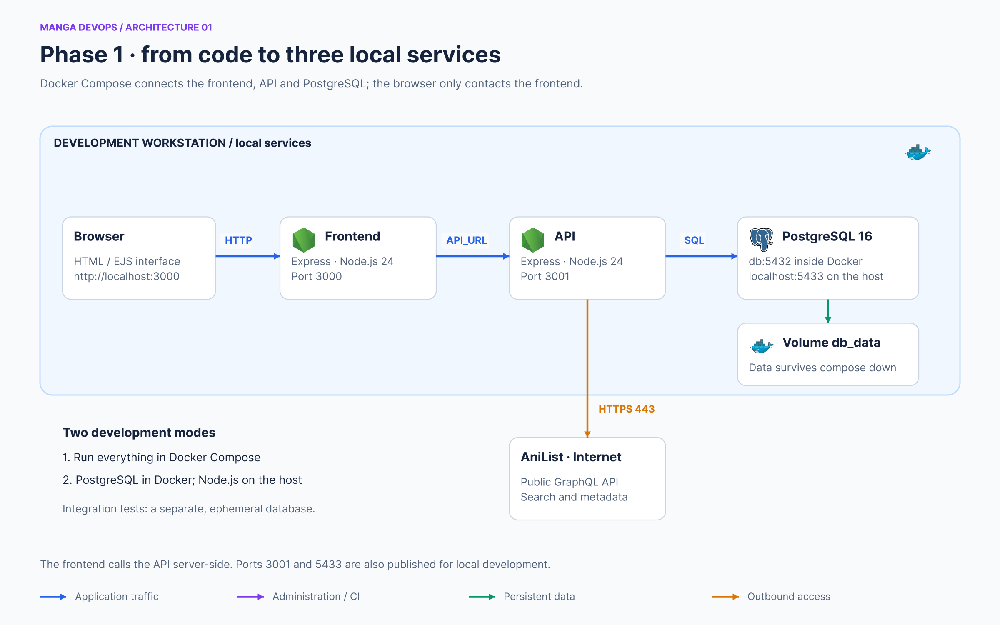
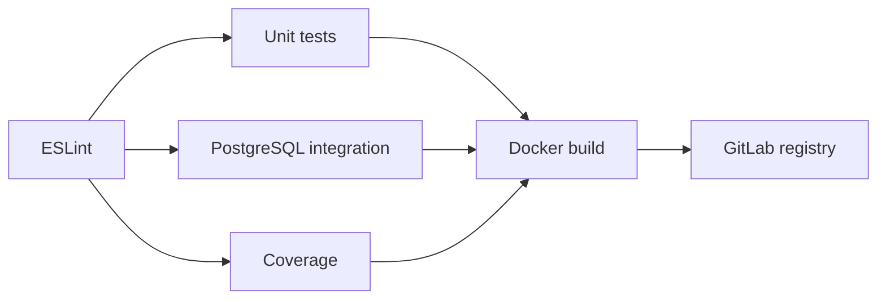

# Phase 1 · local execution and initial checks

[Home](../../README.md) · [Configuration](../../docs/CONFIGURATION.md)



## Objective and requirements

Reproduce all three tiers without cloud infrastructure, then verify that the code and images can be tested. Docker Compose v2 is enough for the fully containerized path. To edit and run Node directly, use Node.js 24 and npm, Git and two terminals. The full repository must include `package-lock.json` and the SQL scripts.

Run the following commands from the application repository root. Copy `.env.example` to `.env`, replace the SQL password, and keep `DATABASE_HOST=localhost`, `DATABASE_PORT=5433` for native local processes.

## Path A · all services in Docker

```bash
cp .env.example .env
# Set DATABASE_PASSWORD in .env.
docker compose config --quiet
docker compose up --build --detach
docker compose ps
docker compose logs --tail=80 db api frontend
curl --fail http://localhost:3001/health
curl --fail http://localhost:3001/ready
curl --fail http://localhost:3000/health
```

Open <http://localhost:3000>, create a reader, search for an anime or manga, add it to the library and save a rating. Refresh the page, then restart the services: the data should remain available.

Startup order is healthy DB → ready API → frontend. The API uses `db:5432`; the frontend uses `api:3001`. Inside a container, `localhost` refers to that container, so do not inject the workstation address used by native processes.

```bash
docker compose restart api frontend
docker compose down
# Start again: the data remains in db_data.
docker compose up --detach
```

`docker compose down --volumes` deletes this stack's volume. Use it only for an intentional development database reset, after backing up any data you need.

## Path B · Docker PostgreSQL, Node.js on the workstation

Do not leave frontend/API containers occupying the same ports. If the stack is already running:

```bash
docker compose stop frontend api
docker compose up --detach db
npm ci
npm run dev:api
```

In a second terminal at the repository root:

```bash
npm run dev:frontend
```

The API loads `.env`, initializes the schema and listens on 3001. The frontend uses `API_URL=http://localhost:3001`. PostgreSQL is published on workstation port 5433, while listening on port 5432 inside its container.

## Tests

```bash
npm ci
npm run lint
npm run test:unit
npm run test:container
npm run test:container:down
```

`test:container` creates an ephemeral `mangas_test` database on tmpfs and runs integration tests. For full coverage in the same environment, run separately:

```bash
docker compose -f compose.test.yml run --build --rm tests npm run test:coverage
docker compose -f compose.test.yml down --volumes
```

Outside Compose, point `TEST_DATABASE_URL` at a **dedicated test database** before running `npm run test:integration` or `npm run test:coverage`. Without this variable, integration tests can be skipped. `npm test` runs unit tests only. Building a Docker runtime target does not force execution of the `test` target; CI provides the separate quality gate.

## Initial CI

The [historical phase 1 pipeline](../../docs/ci-history/phase1-local.gitlab-ci.yml) ran quality checks, tests and publication of a single image. It did not deploy to AWS. A build without `--target` selects the Dockerfile's final target, so this version does not fit today's two-image delivery contract. For a modern build without deployment, refer to the [two-image version](../../docs/ci-history/phase2-build.gitlab-ci.yml).



## Troubleshooting

| Symptom | Check | Resolution |
|---|---|---|
| Port already in use | Running Docker services and Node processes | Use one execution path per port |
| API `ECONNREFUSED` | Database address and context-specific port | localhost:5433 on the workstation, db:5432 in Compose |
| PostgreSQL rejects the password | Volume initialized with a previous password | Update the SQL role using an authorized account; `.env` alone does not do that |
| Missing table | Initialization logs and `sql/` inside the image | Rebuild and verify `COPY sql` |
| Unexpected demo data | `DATABASE_SEED` in the actual runtime | Update the runtime value and check initialization seeding |
| External search fails | API logs, connectivity and AniList response | Distinguish local availability from AniList availability |

Completion criteria: both local endpoints respond, a functional write persists, lint/unit/integration checks pass, and host versus container addresses are understood.
