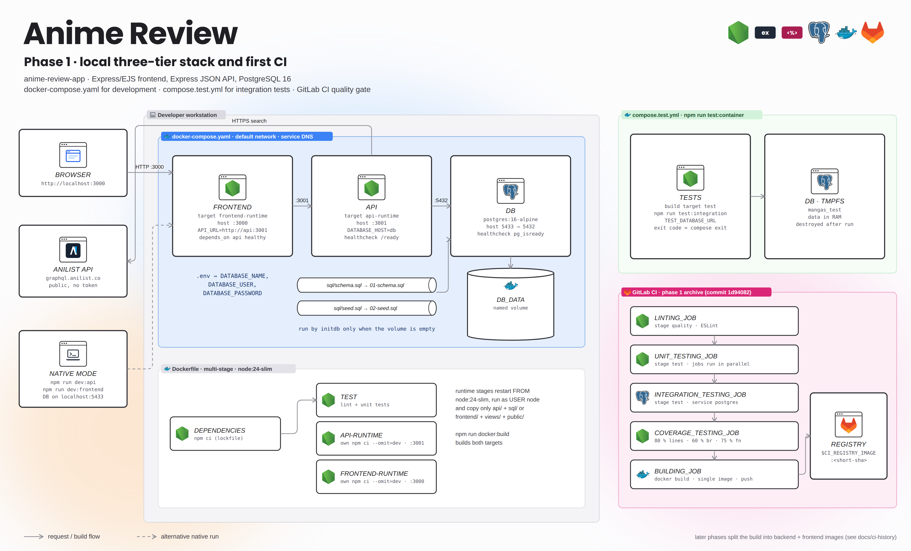
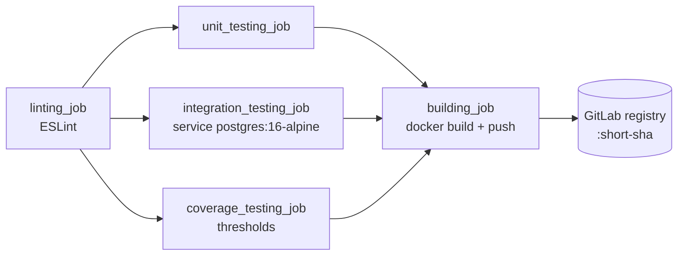

# Phase 1 · Local three-tier stack and first CI

[← Current delivery (phase 3)](../../README.md) · [Phase 2 · AWS VMs](../vm/README.md) · [Configuration](../../docs/CONFIGURATION.md) · [Recovered pipelines](../../docs/ci-history/README.md)

The starting point: run the three tiers on one machine with Docker Compose, test them against a real PostgreSQL, and gate every push on `main` with a GitLab pipeline. No cloud account, token or bucket is needed.


<details>
<summary><b>Detailed view</b> (every component, port and job)</summary>



</details>

## Implemented DevOps features

| Area | What was implemented |
|---|---|
| Split architecture | Frontend (Express + EJS, :3000) and API (Express JSON, :3001) as two processes; only the API talks to PostgreSQL and AniList |
| Multi-stage Dockerfile | `dependencies` (`npm ci` from the lockfile) → `test` (lint + unit); runtime targets `api-runtime` and `frontend-runtime` rebuilt from `node:24-slim` with production dependencies only, `USER node` |
| Compose | service DNS (`api`, `db`), healthchecks (`/ready`, `pg_isready`) and `depends_on: condition: service_healthy`, named volume `db_data`, `schema.sql` / `seed.sql` mounted in `docker-entrypoint-initdb.d`, secrets interpolated from `.env` |
| Test stack | `compose.test.yml`: `tests` container built from the `test` target + PostgreSQL on **tmpfs** (nothing persists), exit code propagated with `--exit-code-from tests` |
| Test pyramid | ESLint · unit tests with module mocks · integration tests on a real database · coverage thresholds (80 % lines, 60 % branches, 75 % functions) |
| First CI | GitLab pipeline on `main`: `quality` → `test` (3 parallel jobs, PostgreSQL service container) → `build` (DinD, push to the project registry) |

## Prerequisites

- Docker Engine / Docker Desktop with Compose v2.
- For native mode: Node.js ≥ 24 and npm.
- Nothing else: AniList is queried anonymously.

### File to prepare

| Example | Copy to | Edit |
|---|---|---|
| [`.env.example`](../../.env.example) | `.env` (git-ignored) | `DATABASE_PASSWORD`; keep `DATABASE_HOST=localhost` / `DATABASE_PORT=5433` for native mode |

## Path A · everything in Docker

```bash
cp .env.example .env                 # set DATABASE_PASSWORD
docker compose config --quiet
docker compose up --build --detach
docker compose ps
curl --fail http://localhost:3001/ready
curl --fail http://localhost:3000/health
```

Open <http://localhost:3000>, create a reader, search a title, add it and rate it. `docker compose restart api frontend` or `down` / `up` keep the data (volume `db_data`). `docker compose down --volumes` deletes it.

Inside containers the API reaches the database at `db:5432` and the frontend reaches the API at `api:3001`; `localhost` would point to the container itself.

## Path B · PostgreSQL in Docker, Node.js on the host

```bash
docker compose stop frontend api     # free ports 3000/3001
docker compose up --detach db        # published on localhost:5433
npm ci
npm run dev:api                      # terminal 1
npm run dev:frontend                 # terminal 2
```

`.env` is loaded by both processes; `API_URL=http://localhost:3001`.

## Tests

```bash
npm ci
npm run lint
npm run test:unit
npm run test:container               # integration tests, ephemeral DB
npm run test:container:down
docker compose -f compose.test.yml run --build --rm tests npm run test:coverage
```

Outside Compose, set `TEST_DATABASE_URL` to a **dedicated** test database before `npm run test:integration`; without it, integration tests are skipped.

## First pipeline

The phase 1 pipeline is archived at [`docs/ci-history/phase1-local.gitlab-ci.yml`](../../docs/ci-history/phase1-local.gitlab-ci.yml) (exact copy of commit `1d94082`). It builds **one** image without `--target`; later phases replaced it with the two-image build.



To run it again, point **Settings → CI/CD → General pipelines → CI/CD configuration file** to that path on a test branch or fork. It needs a runner with privileged Docker-in-Docker and the project registry enabled; no custom variable.

## Troubleshooting

| Symptom | Fix |
|---|---|
| Port already in use | only one mode per port: stop the containers or the Node processes |
| API `ECONNREFUSED` to the DB | `localhost:5433` on the host, `db:5432` inside Compose |
| Password rejected | the volume was initialised with an older password: change the role in SQL or recreate the volume |
| Missing table | check API logs and that `sql/` is present in the image |
| Search fails | distinguish AniList availability from local errors in the API logs |
