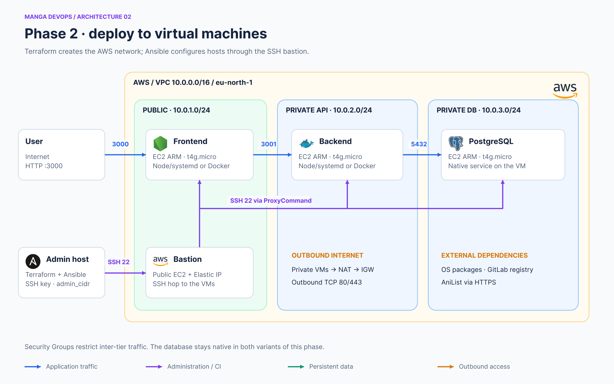
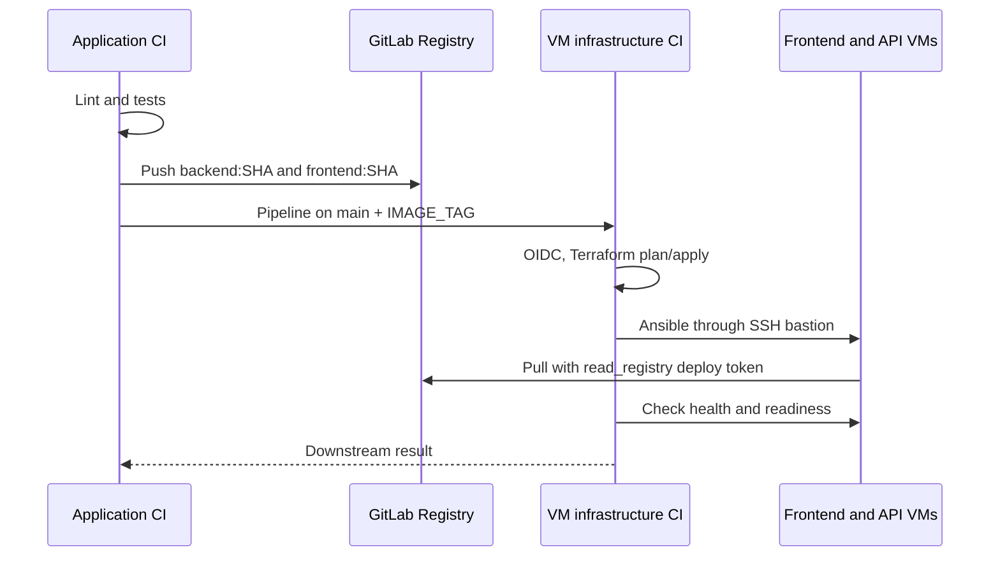

# Phase 2 · deliver the application to AWS VMs

[Home](../../README.md) · [Historical pipelines](../../docs/ci-history/README.md)



## Two steps within the VM phase

1. **Native Node.js**: the infra repository's `legacy/local` playbooks clone the code onto VMs and create systemd services. “Local” refers to the workstation running Ansible; the target machines are in AWS.
2. **Frontend/API containers**: CI publishes two images; Ansible under `legacy/vm/ansible` runs them with Docker. PostgreSQL remains installed natively on its own VM.

The complete Terraform, network, Vault and Ansible procedure is in the infra package's `docs/phases/02-vm/` README. This application repository supplies code, tests and images; it does not create buckets or instances.

## Prepare images

The GitLab project needs an enabled Container Registry and a runner that supports Docker-in-Docker and the privileged container used by `tonistiigi/binfmt`. The runner must reach Docker Hub and GitLab. DinD TLS configuration belongs to the runner setup; the historical pipeline does not provide a universal configuration for it.

Required targets are `api-runtime` and `frontend-runtime`. The `t4g` VMs are ARM64: publishing AMD64-only images causes an architecture mismatch. Multiarchitecture images also support x86 development machines.

To publish manually, first authenticate to the registry with an account allowed to push:

```bash
export REGISTRY_PREFIX='registry.gitlab.com/YOUR_GROUP/YOUR_PROJECT'
export IMAGE_TAG="$(git rev-parse --short=8 HEAD)"
docker buildx create --name manga-builder --use
# If the builder already exists: docker buildx use manga-builder
docker buildx inspect --bootstrap
docker buildx build --platform linux/amd64,linux/arm64 \
  --target api-runtime --tag "$REGISTRY_PREFIX/backend:$IMAGE_TAG" --push .
docker buildx build --platform linux/amd64,linux/arm64 \
  --target frontend-runtime --tag "$REGISTRY_PREFIX/frontend:$IMAGE_TAG" --push .
docker buildx imagetools inspect "$REGISTRY_PREFIX/backend:$IMAGE_TAG"
docker buildx imagetools inspect "$REGISTRY_PREFIX/frontend:$IMAGE_TAG"
```

On a Linux engine without configured emulation, the pipeline's `binfmt` step is required. Docker Desktop support depends on its installation. Inspection should show both platforms. The tag provides traceability by convention, not registry-enforced immutability; do not overwrite a delivered tag.

## Historical VM trigger

The [September 18 pipeline](../../docs/ci-history/phase2-vm.gitlab-ci.yml) triggers `anilist-cicd/anilist-infra` on `main`, uses `strategy: depend`, and passes `IMAGE_TAG`. This version does not pass the registry prefix: the infra repository's Ansible variables supply it. It must point to the actual application registry.

Before enabling this pipeline, also restore the infra repository's VM pipeline or select its historical configuration path in GitLab. The current active infra pipeline configures Kubernetes; sending it an image tag does not restore VM deployment.

In the GitLab infra project, allow the application project under **Settings → CI/CD → Job token permissions**, and check the triggering user's permissions in the target project. Protected-variable availability must match `main` protection. The supplied `trigger: project` does not consume a personal trigger token.



For manual delivery, pass the same `IMAGE_TAG` to Ansible. Do not rebuild images on the VMs. After deployment, test `http://FRONTEND_PUBLIC_IP:3000/health`, then the reader/media workflow. Updating images does not guarantee SQL schema compatibility; handle data changes separately.
