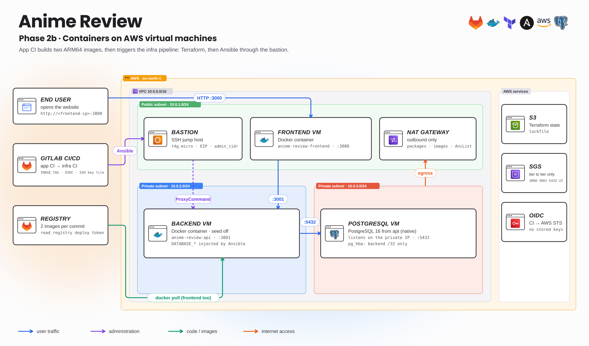
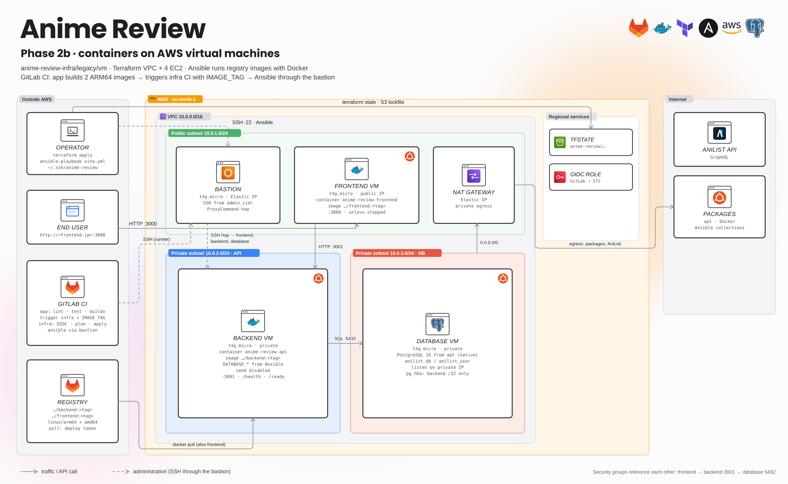
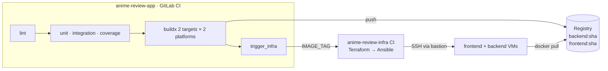

# Phase 2 · Delivering the application to AWS virtual machines

[← Current delivery (phase 3)](../../README.md) · [Phase 1 · local](../local/README.md) · [Recovered pipelines](../../docs/ci-history/README.md)

The application moves to four ARM64 EC2 instances built by [anime-review-infra](https://github.com/Songhai9/anime-review-infra). This phase had two steps:

1. **2a · Native Node.js** — Ansible clones this repository on the VMs and runs it with systemd ([infra › legacy/local](https://github.com/Songhai9/anime-review-infra/tree/main/legacy/local)). Nothing changes in this repo.
2. **2b · Container images** — this pipeline builds two multi-arch images and **triggers the infrastructure pipeline** with the tag; Ansible runs the images on the VMs ([infra › legacy/vm](https://github.com/Songhai9/anime-review-infra/tree/main/legacy/vm)).



<details>
<summary><b>Detailed view</b> (every component, port and job)</summary>



</details>

## Implemented DevOps features (app side)

| Area | What was implemented |
|---|---|
| Two images | `docker buildx --target api-runtime` → `…/backend:<sha>` and `--target frontend-runtime` → `…/frontend:<sha>` |
| Multi-architecture | QEMU via `tonistiigi/binfmt`, `--platform linux/amd64,linux/arm64`: the same tag runs on Graviton VMs and x86 laptops |
| Registry | GitLab Container Registry, authenticated with the built-in `CI_REGISTRY_*` variables |
| Build workaround | `BUILDX_NO_DEFAULT_ATTESTATIONS=1` so the registry does not list `unknown/unknown` provenance manifests |
| Continuous delivery | `trigger_infra`: multi-project pipeline to `anilist-cicd/anilist-infra` on `main` with `IMAGE_TAG=$CI_COMMIT_SHORT_SHA`, `strategy: depend` |
| Immutability | images built once, pulled by the VMs with a `read_registry` deploy token; the infra side never builds code |



## Recovered pipelines

| File | From commit | Purpose |
|---|---|---|
| [`phase2-build.gitlab-ci.yml`](../../docs/ci-history/phase2-build.gitlab-ci.yml) | `ef6d75b` | tests + two-image multi-arch build, no deployment |
| [`phase2-vm.gitlab-ci.yml`](../../docs/ci-history/phase2-vm.gitlab-ci.yml) | `acb7c59` | same + `trigger_infra` (VM delivery) |

They are exact copies. Keep them under `docs/ci-history/` (they do not run there). To replay phase 2b, select one as **CI/CD configuration file** in a dedicated project or branch **and** activate the infra repository's VM pipeline (`legacy/.gitlab-ci.yml`); the current infra root pipeline configures Kubernetes and ignores `IMAGE_TAG`.

## Prerequisites

- GitLab registry enabled; runner with privileged DinD, access to Docker Hub.
- In **anime-review-infra**: *Job token permissions* allow this project; the triggering user can run pipelines there; its variables are described in [infra › legacy/vm](https://github.com/Songhai9/anime-review-infra/blob/main/legacy/vm/README.md#gitlab-variables-for-the-pipeline).
- A deploy token (`read_registry`) stored in the infra Ansible Vault.
- `registry_image_prefix` in the infra Ansible vars pointing at this project's registry.

## Publish images by hand

```bash
export REGISTRY_PREFIX=registry.gitlab.com/YOUR_GROUP/YOUR_PROJECT
export IMAGE_TAG=$(git rev-parse --short=8 HEAD)
docker login registry.gitlab.com
docker buildx create --name manga-builder --use 2>/dev/null || docker buildx use manga-builder
docker buildx build --platform linux/amd64,linux/arm64 --target api-runtime \
  -t "$REGISTRY_PREFIX/backend:$IMAGE_TAG" --push .
docker buildx build --platform linux/amd64,linux/arm64 --target frontend-runtime \
  -t "$REGISTRY_PREFIX/frontend:$IMAGE_TAG" --push .
docker buildx imagetools inspect "$REGISTRY_PREFIX/backend:$IMAGE_TAG"   # must list arm64
```

Then deploy that tag with Ansible from the infra repository (`-e image_tag=$IMAGE_TAG`). Check `http://<frontend-public-ip>:3000/health` and a real write through the UI.

Never overwrite a tag that has been delivered: the SHA tag is the link between a commit and what runs.
